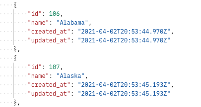
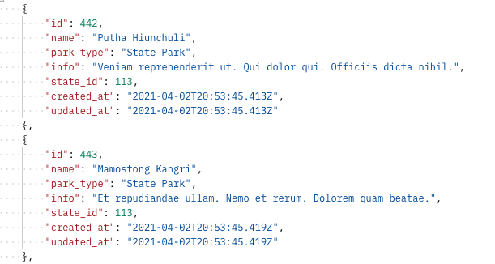
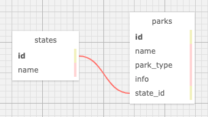

# _State Park API_

### By _**Jo Miller**_

#### _This project was created solely for the education of the author(s) and is not in a complete or portfolio-ready state. It should not be considered representative of professional work._

[Epicodus](https://www.epicodus.com/) - [Ruby and Rails](https://www.learnhowtoprogram.com/ruby-and-rails/) - [Week 6](https://www.learnhowtoprogram.com/ruby-and-rails/building-an-api/building-an-api-independent-project)

#### Date created: 04/02/2021
* * *

## Description

A State and National Park API. A user cal make API calls to get a list of State and National Parks by state, or update, post, and delete states or parks. 

---

## Technologies Used

* _Ruby 2.6.5_
* _Rails 6.1.3_
* _Embedded Ruby (ERB)_
* _pg 1.2.3_
* _Webpacker 5.2.1_
* _Rspec Rails 5.0.0_
* _Byebug 11.1.3_
* _PostgreSQL 13.2_
* _Bundler 2.2.11_
* _Puma 5.2.2_
* _Faker 2.17.00_
* _git 2.30.0_
* _FactoryBot_
* _Should Matchers_

---

## Authentication

This service requires no authentication to use.

## Demo API

To Demo this API, follow the installation instructions listed below and navigate to http://localhost:3000/index.html in your browser. \
There you can live demo the following API calls:

Action | Route | Description
| :--- | --- | ---: |
| GET | /random | _Fetches a random park_ | 
| GET | /states | _Fetches all states_ |
| POST | /states | _Creates a state_ |
| DELETE | /states/{id} | _Deletes an existing state and the parks within it_ | 
| GET | /states/{id} | _Fetches a single state_ | 
| PATCH | /states/{id} | _Updates an existing state_ | 
| GET | /states/{id}/parks | _Fetches all parks for a specific state_ |
| POST | /states/{id}/parks | _Creates a new park_ |
| DELETE | /states/{id}/parks/{id} | _Deletes an existing park_ | 
| GET | /states/{id}/parks/{id} | _Fetches a single park a state_ | 
| PATCH | /states/{id}/parks/{id} | _Updates an existing park_ | 

## Responses & Errors

* `GET /states` - sample response
    * 

* `GET /states/113/parks` - sample response
    * 

* 404 - NOT FOUND \
  **{ "message": "Couldn't find State with 'id'=  " }**
* 422 - UNPROCESSABLE ENTITY \
  **{ "message": "Validation failed" }**
* 500 - INTERNAL SERVER ERROR \
  **{ "error": "Internal Server Error" }**

## Database Schema 
The database for this application has the following tables and relationships:

---

## Requirements

* You will need to use your system's **terminal emulator** to setup and locally use this application.
* You must have **Ruby 2.6.5** installed to be able to launch this application ([how to install Ruby 2.6.5](https://www.learnhowtoprogram.com/ruby-and-rails/getting-started-with-ruby/installing-ruby)).
* **PostgreSQL** is required to manage this application's database. You can [follow this link](https://www.enterprisedb.com/downloads/postgresql) to install it.
* **Yarn** is required to utilize the live server with Rails 6.1.3, you can find yarn installation instructions [here](https://classic.yarnpkg.com/en/docs/install/#mac-stable).

---

## Setup/Installation

* To clone this directory, navigate in your terminal to the desired location of the project and run command `$ git clone https://github.com/joanna-miller/state_park_api.git`
* Navigate to top level of the directory with command `$ cd state_park_api`
* To install bundler for managing gems run command `$ gem install bundler`
* To install gems into the project run command `$ bundle install`
* To install dependencies with webpacker, run command `$ rails webpacker:install`
* Launch PostgreSQL to run a persistent database management server with command `$ postgres`
* To recreate database, run command `$ rake db:setup`
* To run tests using rspec, run command `$ rspec`
* To run a live server, from the root level of the project directory in your terminal, run command `$ rails server`
* To interact with application, navigate to http://localhost:3000/ in a web browser.
* Exit live server, press Ctrl+C in your terminal

--- 

## Editing Instructions

* To use Visual Studio Code to edit this project, follow install instructions [here](https://code.visualstudio.com/).
* To enable command `code`, open VS Code, click on View > Command Palette, type in "shell command", and click on "Shell Command: Install 'code' command in PATH"
* Now, from your terminal, in the project's top level directory, you can run command `code .` to open project in VS Code.

---

## Known Bugs

* Please report any bugs to developer, contact info below. 

---

## License

[MIT](LICENSE.txt)

---

## Contact Information

* _Contact Jo via [Email](mailto:joannadawnmiller@gmail.com) or [LinkedIn](https://www.linkedin.com/in/jomillerde/), or check out her [Github](https://github.com/joanna-miller)._
